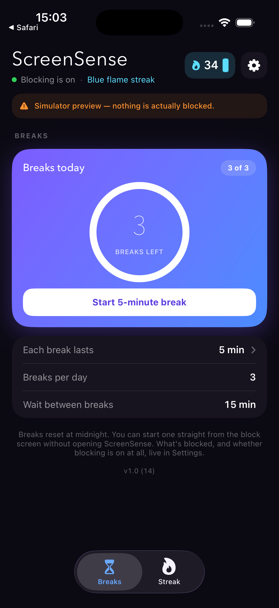
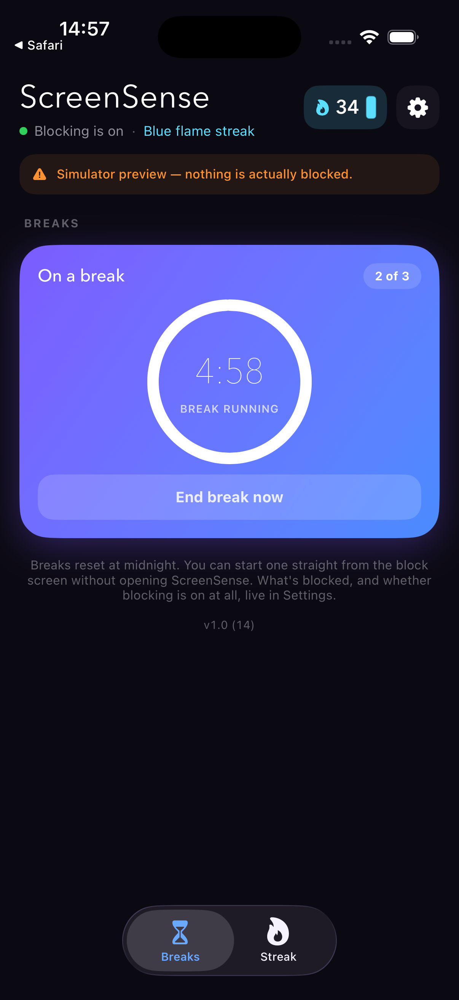
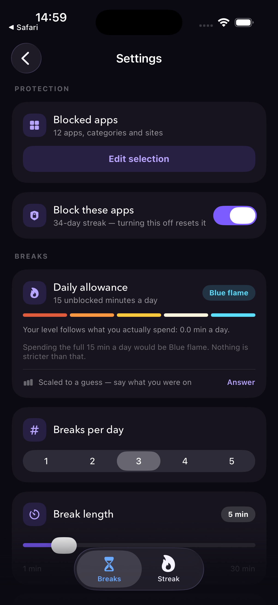
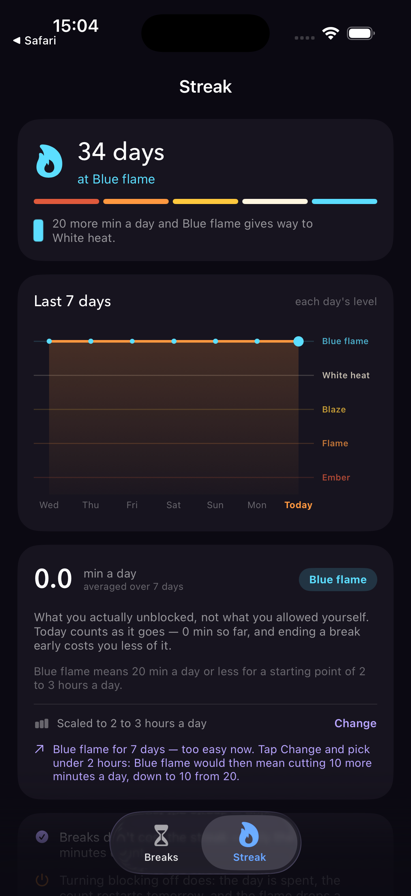

# ScreenSense

An iOS app blocker with **no limit on how many apps you block** and a break budget you set
yourself: **1–5 breaks per day, 1–30 minutes each, with a 5-minute to 1-hour enforced wait
between them** (defaults: 3 breaks of 5 minutes, 15 minutes apart).
Built on Apple's Screen Time APIs
(FamilyControls / ManagedSettings / DeviceActivity), so the blocking is enforced by iOS
itself rather than by a VPN profile or a DNS trick.

## Screenshots

<p align="center">
  
  
  
  
</p>
<p align="center"><em>Breaks · a break running · settings · streak. Captured in the simulator, where the app shows a preview banner because nothing is actually blocked there.</em></p>

## Why this exists

The App Store blockers tend to fail in one of two ways: they gate a basic block list
behind a subscription, or they cap how many apps you can add. Neither limit is technical.
Apple hands you a `Set<ApplicationToken>` with no size cap, and blocking one app costs
exactly what blocking forty does. ScreenSense just doesn't add the artificial ceiling.

## How it works

Four processes share one App Group container:

| Target | Role |
|---|---|
| `ScreenSense` | The app. Pick apps, toggle blocking, set the budget, spend a break. |
| `Monitor` | `DeviceActivityMonitor` extension. Re-applies the block when a break ends — **even if the app is force-quit**. |
| `ShieldConfig` | Draws the block screen. |
| `ShieldAction` | Handles taps on that screen, so you can start a break without opening ScreenSense. |

### The break mechanism

This is the one genuinely tricky part. iOS **rejects any `DeviceActivitySchedule` shorter
than 15 minutes**, so a 1-minute break cannot be expressed as the length of a schedule.

The way around it is that the 15-minute floor governs how *long* an interval may be, not
how far ahead it may begin. So a break arms a second activity, `.breakEnd`, whose interval
is scheduled to **start** at the moment the break expires. `intervalDidStart` then fires
then, to the second, and re-applies the shield — even if the user is still inside the
blocked app at that moment.

Three triggers, in the order they're relied on:

1. **Resume interval (primary).** `.breakEnd` begins when the break's wall clock runs out.
   Accurate to the second and independent of what the user is doing.
2. **`DeviceActivityEvent` threshold + padded interval (backstop).** Thresholds fire on
   accumulated usage of the blocked apps, and the padded window fires `intervalDidEnd` at
   the 15-minute floor. Both only matter if the resume interval fails to fire.
3. **Foreground reconcile (repair).** `BreakEngine.reconcile()` runs on every app launch
   and foreground, closing a break whose wall clock expired while nothing was watching.

All three call `BreakEngine.endBreak()`, which is idempotent — whichever arrives first
wins and the others are no-ops.

Breaks are **wall clock**, not usage. A 5-minute break ends five minutes after it starts
whether you spent them in the app or left the phone face-down. An earlier version counted
usage instead, so that idle time didn't burn the break — a nicer idea that iOS cannot
actually deliver, because usage is accounted in coarse batches and a short threshold
arrives minutes late or, if the blocked app is never opened, not at all.

Ending a break early does **not** refund it. That's the point of a budget.

### The cooldown

When a break ends, a wait starts before another can begin — otherwise the whole day's
allowance could be spent in one continuous sitting, which is the failure mode the budget
exists to prevent.

Unlike breaks, the cooldown is **wall clock**, deliberately. A usage-based cooldown could
be run down from inside a blocked app, which would defeat it entirely.

The cooldown is anchored to when the break *actually* ended, not to when ScreenSense
noticed. Ending early makes that the moment you tapped; a break that expired while the app
was closed is anchored to its scheduled end (`min(scheduledEnd, now)`). Anchoring to "now"
unconditionally would silently stretch the cooldown by however long the app stayed shut.

### Daily reset

Breaks reset at your local midnight. There's no scheduled job — state carries a
`yyyy-MM-dd` stamp and whichever process reads it first on a new day performs the reset.

## Requirements

- **A physical iPhone.** The Screen Time APIs do nothing in the Simulator: the picker is
  empty and every write to `ManagedSettingsStore` is silently dropped. The project
  compiles for the Simulator, but you cannot test behavior there.
- Xcode 16+ and iOS 16.0+ on device.
- [XcodeGen](https://github.com/yonaskolb/XcodeGen) — `brew install xcodegen`.
- An Apple Developer account — realistically the **paid** Program ($99/year). See below.

## Setup

```bash
git clone https://github.com/sleepyowlll/screenblock.git
cd screenblock
```

1. Open `Config/Signing.xcconfig` and set two values:
   - `DEVELOPMENT_TEAM` — your 10-character Team ID (Xcode › Settings › Accounts, or
     developer.apple.com/account › Membership Details).
   - `BUNDLE_ID_PREFIX` — **change this**. Bundle IDs are globally unique across the App
     Store, so `com.screenblock.app` will not be available to you. Use something like
     `com.yourname.screenblock`. The App Group follows automatically.

   This is the **only** file you need to edit. All four bundle IDs, all four entitlements
   files, and the App Group identifier in every Info.plist derive from those two values.

2. Generate and open the project:

   ```bash
   ./generate.sh
   open ScreenSense.xcodeproj
   ```

3. **Enable Developer Mode on the iPhone** — Settings › Privacy & Security › Developer
   Mode, toggle on, and let it restart. This is required on iOS 16+ and the option only
   appears after the phone has been plugged into Xcode at least once.

4. Select your iPhone in Xcode's device menu and press Run. In Xcode's Signing &
   Capabilities tab, confirm each of the four targets shows your team with no red errors —
   automatic signing registers the App Group and Family Controls entitlement for you.

5. On the phone, trust the certificate: Settings › General › VPN & Device Management ›
   your developer account › Trust.

6. Launch the app, tap **Grant access**, and approve the Screen Time prompt.

To test quickly, set break length to 1 minute and the wait to 5 minutes in Settings —
otherwise you're sitting through real cooldowns to see a state change.

`ScreenSense.xcodeproj` is generated and gitignored — edit `project.yml`, not the project.

### Account and entitlement caveats

Two separate things gate this app, and it's worth keeping them apart.

**1. The Family Controls entitlement.** For *development* builds signed to your own device,
you just tick the Family Controls capability in Xcode — no approval needed. Shipping to
TestFlight or the App Store requires
[requesting the distribution entitlement from Apple](https://developer.apple.com/contact/request/family-controls-distribution),
which is a manual review that can take days or weeks.

**2. Free vs. paid account.** A free Apple ID ("Personal Team") allows on-device testing,
but with limits that bite this project specifically:

- **10 App IDs per 7 days.** ScreenSense needs 5 registrations (4 targets + 1 App Group),
  so two setup attempts in a week can exhaust the quota and lock you out until it resets.
- **Provisioning expires after 7 days**, so the app stops launching weekly until you
  rebuild from Xcode.
- App Group support on a Personal Team is inconsistently reported. Without a working App
  Group the extensions can't read the app's state, and blocking silently misbehaves.

Try free if you want — it costs nothing and you'll know within half an hour. But the
[paid Developer Program](https://developer.apple.com/support/compare-memberships/)
($99/year) is the path that reliably works for a four-target app with shared containers.

## Using it

1. **Choose apps** — Apple's own picker. Pick as many apps, whole categories, and websites
   as you want.
2. **Toggle blocking on.** Blocked apps now show the ScreenSense shield.
3. **Set your budget** — the gear in the top right, or tap the "Each break lasts" row on
   the home screen. Breaks per day is a 1–5 segmented control; break length is a 1–30
   minute slider; the wait between breaks is a 5–60 minute slider. Changes save immediately
   and the block screen picks them up at once.
4. **Need in?** Either open ScreenSense and hit **Start break**, or tap **Take a break**
   directly on the block screen — that spends one break and drops you straight into the
   app without ever leaving it.

Lowering breaks-per-day below what you've already spent today doesn't claw anything back;
it takes effect from tomorrow, and the settings screen says so when that applies.

## Privacy

ScreenSense never learns which apps you blocked. `FamilyControls` returns opaque,
device-bound tokens — no bundle IDs, no names, nothing inspectable or loggable. All state
lives in a local App Group container. There is no network code in this project.

## Project layout

```
Config/Signing.xcconfig   Team ID + bundle prefix — the only file to edit
project.yml               XcodeGen spec (4 targets)
Shared/                   Compiled into all four targets
  AppIdentifiers.swift    App Group plumbing
  BreakState.swift        Hard limits + state model + daily rollover
  BreakSettings.swift     User-chosen breaks/day and break length
  BreakStore.swift        App Group persistence
  ShieldController.swift  The only writer of shield tokens
  BreakEngine.swift       start / end / reconcile a break
ScreenSense/              SwiftUI app
Monitor/                  DeviceActivityMonitor extension
ShieldConfig/             Block screen appearance
ShieldAction/             Block screen buttons
Tools/
  make-icon.swift         Renders the app icon
  ui-preview.html         Every screen and state, in a browser
```

## Known limits

- Determined users can disable the block by deleting the app or revoking Screen Time
  access in Settings. There is no lock-down mode; this is a speed bump against impulse,
  not a security control.
- The shield returns the second a break expires, but iOS decides when to draw it over an
  app that is already open. Expect it to land within moments rather than instantly.
- Only the standard icon is supplied. iOS 18+ derives its dark and tinted home-screen
  variants automatically; hand-tuned ones aren't included.

## The UI preview

`Tools/ui-preview.html` renders every screen and state as static HTML — open it in any
browser, no Xcode and no device:

```bash
open Tools/ui-preview.html
```

Thirteen frames: the permission gate (granted and denied), the home screen across its
states (nothing selected, idle, break running, cooling down, budget spent, and a 5 × 20
minute configuration), settings at defaults and with both warnings showing, and the three
block screens. Copy and enable/disable rules are transcribed from the sources, and the
palette comes from `Theme` in `RootView.swift`, so the two can be diffed by eye.

It is a *reference*, not a build: the SF Symbols are hand-drawn SVG approximations and the
system controls (segmented picker, sliders, toggle, shield sheet) are CSS lookalikes. It
also can't tell you whether anything works — it renders states, it doesn't run the engine.
The Simulator remains the only place the real layout and the real logic are both true.

## The app icon

The icon is generated, not drawn — `Tools/make-icon.swift` renders it with CoreGraphics:

```bash
swift Tools/make-icon.swift
```

That writes `ScreenSense/Assets.xcassets/AppIcon.appiconset/AppIcon.png` (1024×1024) plus a
throwaway 120px preview for checking that the mark still reads at home-screen size. Colours
track `Theme.accent`, so the icon and the in-app UI can't drift apart.

Two constraints are baked into the renderer and worth keeping if you edit it: the bitmap
uses `noneSkipLast` so the PNG carries **no alpha channel** (App Store Connect rejects app
icons with transparency), and no corner rounding is baked in (iOS applies its own mask —
a pre-rounded icon shows a dark fringe).
